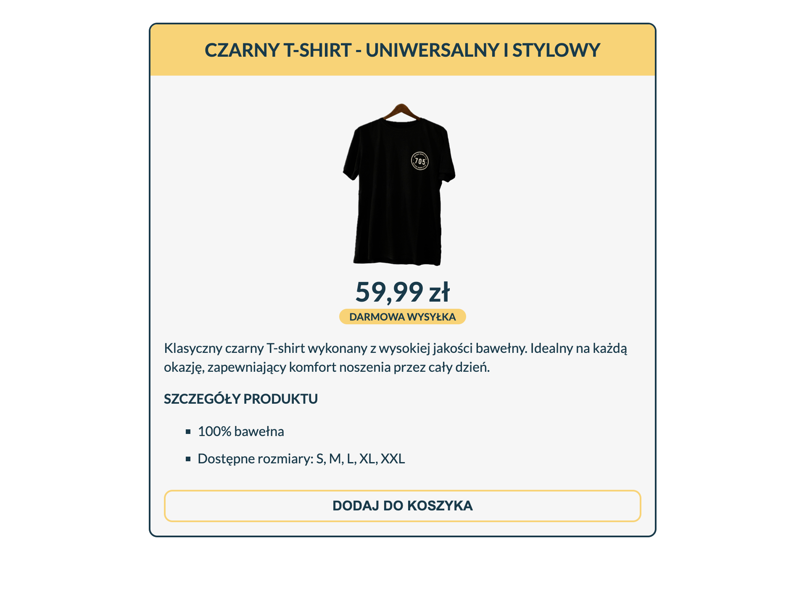

# Projekt - strona produktu sklepu internetowego
[Kliknij tutaj aby rozwiązać zadanie](https://githubbox.com/Publishing-School/css-strona-produktu-sklepu-internetowego)

### Zasady projektowania 
* Rodzina czcionek: Lato, sans-serif
* Kolor tła: #f6f6f6
* Kolor tekstu: #073b4c
* Kolor tła nagłówka: #ffd166
* Maksymalna szerokość: 600px
* Zawartość strony wyśrodkowana za pomocą margin: 0 auto
* Przycisk dodaj do koszyka po najechaniu myszką ma zmienić kolor tła na #073b4c i kolor tekstu na #ffd166

**Pamiętaj o wykorzustaniu semantycznego HTML**

Rozwiązanie

